# DKDOS

  

<map name="dkdos-map">
  <area alt="projects" title="projects" href="./screens/projects.svg" coords="80,414,270,446" shape="rect" />
  <area alt="opensource" title="opensource" href="./screens/opensource.svg" coords="280,414,470,446" shape="rect" />
  <area alt="experiments" title="experiments" href="./screens/experiments.svg" coords="510,414,700,446" shape="rect" />
  <area alt="resume" title="resume" href="./screens/resume.svg" coords="80,462,270,494" shape="rect" />
  <area alt="contact" title="contact" href="./screens/contact.svg" coords="280,462,470,494" shape="rect" />
  <area alt="help" title="help" href="./screens/help.svg" coords="510,462,660,494" shape="rect" />
  <area alt="sudo" title="sudo" href="./screens/sudo.svg" coords="670,462,800,494" shape="rect" />
  <area alt="coffee" title="coffee" href="./screens/coffee.svg" coords="810,462,940,494" shape="rect" />
  <area alt="matrix" title="matrix" href="./screens/matrix.svg" coords="810,414,940,446" shape="rect" />
</map>
